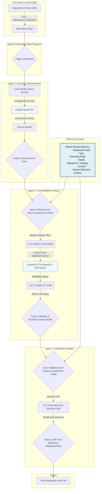

# Civic Grant Agent Core

An intelligent multi-agent system for automating grant discovery, validation, and application drafting for civic organizations.

## Documentation

This project is documented using [Google Code Wiki](https://codewiki.google), an AI-powered tool that automatically generates and maintains documentation from the codebase.

<!-- Once the repository is public, the Code Wiki link will be available here -->

## Agent Flow Diagram
