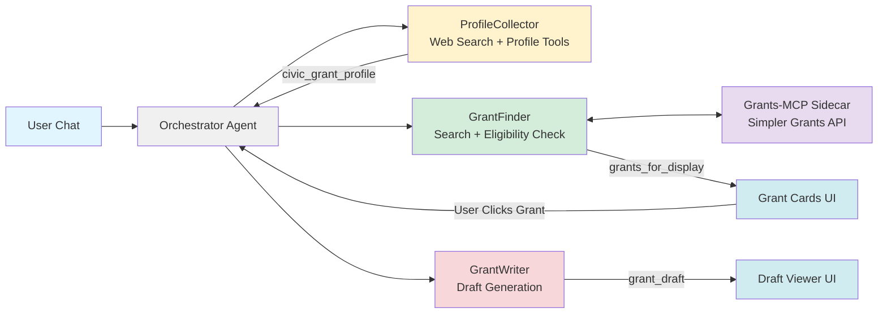

# Civic Grant Agent: Grant-Finder & Draft-Writer Agent

> **A free, open-source AI agent framework built for civic good.** This tool is designed to help volunteer fire departments, EMS agencies, and other public service organizations secure critical funding—no cost, no barriers, just community impact.

---

## 📑 Table of Contents

**Overview**  
  ➜ [The Problem](#-the-problem)  
  ➜ [The Solution](#-the-solution)  
  ➜ [How to Use](#-how-to-use)  
  ➜ [For Civic Organizations](#-for-civic-organizations)  

**Architecture**  
  ➜ [System Architecture](#-architecture)  
  ➜ [Agent Flow Diagram](#agent-flow-diagram)  
  ➜ [Key Features](#-key-features)  
  ➜ [Deployment](#-deployment)  

**Project**  
  ➜ [License](#-license)  
  ➜ [Contributing](#-contributing)  
  ➜ [Acknowledgments](#-acknowledgments)  

---

# Overview

## 🚒 The Problem

Volunteer fire departments and EMS agencies are critically under-funded. They rely on complex grants (federal, state, corporate) and private donations, but they lack the time and expertise to find and apply for them effectively. Small volunteer departments often lose out on thousands of dollars in available funding simply because they don't have the staff to:

- **Research** grant opportunities across multiple sources
- **Evaluate** which grants they're eligible for
- **Draft** compelling, professional grant applications

For many volunteer departments, grant research and writing can consume **20+ hours per week** of limited volunteer time.

### The Civic Tech Gap

While the grant-writing AI space has several commercial platforms (Grantable, GrantWriter, Grant Assistant), these are:
- **Closed-source** SaaS products with subscription fees
- **Built for general non-profits**, not specialized civic organizations
- **Too expensive** for small volunteer departments with limited budgets

Similarly, existing open-source projects target different audiences:
- **Municipal governments** (GrantWell) - for government employees, not volunteers
- **Medical/NIH grants** (Grant_Guide) - highly specialized for academic research

### Our Unique Position

**Civic Grant Agent** fills a critical gap by providing:

✅ **Open-Source & Free** - No subscription fees, no vendor lock-in, built for the public good  
✅ **Civic-Focused** - Purpose-built for volunteer fire departments, EMS, and public safety organizations  
✅ **Lightweight Core** - A flexible agent engine, not a heavy all-in-one platform  
✅ **Department Memory** - Understands the unique identity and needs of civic volunteer organizations  

**This is a not-for-profit tool.** Public service agencies are invited to use it freely to better serve their communities.

## 💡 The Solution

**Civic Grant Agent** is a free, open-source multi-agent system built with Google's Agent Developer Kit (ADK) that autonomously:

1. **Scans** the web for new, relevant grant opportunities
2. **Filters** them based on the department's specific profile (volunteer/paid, service area, equipment needs)
3. **Drafts** a high-quality initial application for the most promising grants

---

## 🚀 How to Use

**Try it live at [civic-grant-agent.xomanova.io](https://civic-grant-agent.xomanova.io)**

The workflow is simple:

1. **Tell the agent about your organization** - Chat with the agent to provide information, or send it all at once!
2. **Review matching grants** - The agent searches and displays grants you're eligible for
3. **Generate a draft application** - Click any grant to have the agent write a professional draft for you to review and submit

### Full Workflow Demo


## 🌟 For Civic Organizations

**This tool is for you.** If you're a volunteer fire department, EMS agency, rescue squad, or other public service organization:

- ✅ **It's completely free** - No hidden costs, no subscriptions, no trials
- ✅ **You own your data** - No data is stored on the agent servers beyond your session
- ✅ **Easy to use** - No technical expertise required, just chat with the agent
- ✅ **Designed for your needs** - Built specifically for civic organizations like yours
- ✅ **Open to feedback** - Tell us what you need, and we'll work to make it better

---

# Architecture

## 🏗️ System Architecture

This system uses a **multi-agent architecture** powered by Google's ADK with a custom orchestrator and AG-UI Protocol for real-time frontend communication:

**Interactive Flow:**
```
User Chat → Orchestrator → ProfileCollector → GrantFinder → GrantWriter → UI Display
```

### Orchestrator Agent (Router)
- **Purpose**: Manages workflow state and routes requests to appropriate sub-agents
- **Features**: Handles profile completion detection, workflow transitions, and state management
- **Protocol**: Communicates with React frontend via AG-UI Protocol and CopilotKit

### Agent 1: ProfileCollector (Interviewer)
- **Tools**: Web Search, Profile Update
- **Purpose**: Conversationally gathers department information through chat
- **Features**: Enriches profiles with web search data, validates completeness
- **Output**: Complete department profile stored in session state


### Agent 2: GrantFinder (Scout + Validator)
- **Tools**: Web Search, Grants-MCP Client, Eligibility Checker, State Filter
- **Purpose**: Discovers grants and validates eligibility in one step
- **Features**: State-based filtering, federal grant detection via Simpler Grants API, match scoring (0-100%)
- **Output**: Ranked grants displayed as interactive cards in the UI


### Grants-MCP Sidecar
- **Purpose**: Provides access to federal grants from Grants.gov via the Simpler Grants API
- **Protocol**: Model Context Protocol (MCP) server running as a Cloud Run sidecar on port 8081
- **Tools**: `search_grants`, `get_grant_details`, `list_grant_agencies`, `list_grant_categories`
- **Integration**: Called by GrantFinder agent via `grants_mcp_client.py`

### Agent 3: GrantWriter (Drafter)
- **Tools**: Save Draft
- **Purpose**: Generates professional grant application narratives
- **Output**: Complete grant draft displayed with rich markdown rendering


**State Management:** Session state syncs bidirectionally between backend and frontend via AG-UI Protocol. The frontend uses CopilotKit's `useCoAgent` hook for real-time state updates.

## Agent Flow Diagram


## 📋 Key Features

### Custom Orchestrator Architecture
- **Workflow State Machine**: Manages transitions between profile building, grant scouting, and draft writing
- **AG-UI Protocol**: Real-time bidirectional state sync with React frontend
- **Smart Routing**: Detects profile completeness and routes to appropriate agent

### Agent 1: ProfileCollector (Interviewer)
- **Conversational UX**: Gathers department info through natural chat interaction
- **Web Enrichment**: Uses web search to find additional department details
- **Profile Validation**: Ensures minimum required fields before advancing
- **Output**: Department profile stored in `civic_grant_profile` state key

### Agent 2: GrantFinder (Scout + Validator)
- **Comprehensive Search**: Searches FEMA AFG, SAFER, Grants.gov, Firehouse Subs, and more
- **State-Based Filtering**: Filters out grants from other states (detects state names in URLs too)
- **Eligibility Scoring**: Multi-criteria analysis with match percentage (0-100%)
- **Interactive Cards**: Grants displayed as clickable cards with match reasons
- **Output**: Validated grants stored in `grants_for_display` state key

### Agent 3: GrantWriter (Drafter)
- **Gemini-Powered**: Uses Gemini for high-quality, professional drafts
- **Tool-Based Saving**: Saves draft via tool call for reliable state sync
- **7-Section Structure**: Executive Summary, Background, Need, Project, Budget, Impact, Sustainability
- **Rich Rendering**: Draft displayed with markdown formatting in dedicated panel
- **Output**: Professional draft stored in `grant_draft` state key


## 🌐 Deployment

Deploy the full stack (backend + frontend) to Google Cloud Run and Firebase:

```bash
./deployment/firebase-deploy.sh
```

See `deployment/DEPLOYMENT_GUIDE.md` for detailed instructions and configuration options.

---

# Project

## 📄 License

Apache 2.0 License - See [LICENSE](LICENSE) file for details.

This is free software for public good. Use it, modify it, share it with other civic organizations.

## 🤝 Contributing

This project is designed to help volunteer fire departments, EMS agencies, and other civic organizations. We welcome contributions from:

- **First Responders** - Share your needs and grant-writing experience
- **Developers** - Improve the agent framework, add new tools, enhance performance
- **Grant Professionals** - Help refine prompts and validation logic, identify grant data sources
- **Documentation Writers** - Make this tool more accessible to non-technical users

## 🙏 Acknowledgments

Built with Google's Agent Developer Kit for the "Capstone Project: Agents for Good" track for https://www.kaggle.com/learn-guide/5-day-agents

**Special thanks to:**
- All volunteer emergency services personnel who inspired this work
- The civic tech community working to bridge the gap between technology and public service
- Public safety organizations everywhere who serve their communities despite funding challenges