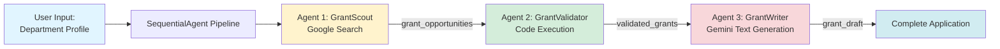

# Civic Grant Agent: Grant-Finder & Draft-Writer Agent

> **A free, open-source AI agent framework built for civic good.** This tool is designed to help volunteer fire departments, EMS agencies, and other public service organizations secure critical funding—no cost, no barriers, just community impact.

## 🚒 The Problem

Volunteer fire departments and EMS agencies are critically under-funded. They rely on complex grants (federal, state, corporate) and private donations, but they lack the time and expertise to find and apply for them effectively. Small volunteer departments often lose out on thousands of dollars in available funding simply because they don't have the staff to:

- **Research** grant opportunities across multiple sources
- **Evaluate** which grants they're eligible for
- **Draft** compelling, professional grant applications

For many volunteer departments, grant research and writing can consume **20+ hours per week** of limited volunteer time.

## 💡 The Solution

**Civic Grant Agent** is a free, open-source multi-agent system built with Google's Agent Developer Kit (ADK) that autonomously:

1. **Scans** the web for new, relevant grant opportunities
2. **Filters** them based on the department's specific profile (volunteer/paid, service area, equipment needs)
3. **Drafts** a high-quality initial application for the most promising grants

**Value Proposition:** This agent system turns a 20-hour/week manual research task into a 1-hour/week review task, directly increasing a department's ability to secure funding for life-saving equipment.

---

## 🎯 Why This Project Exists

### The Civic Tech Gap

While the grant-writing AI space has several commercial platforms (Grantable, GrantWriter, Grant Assistant), these are:
- **Closed-source** SaaS products with subscription fees
- **Built for general non-profits**, not specialized civic organizations
- **Too expensive** for small volunteer departments with limited budgets

Similarly, existing open-source projects target different audiences:
- **Municipal governments** (GrantWell) - for government employees, not volunteers
- **Medical/NIH grants** (Grant_Guide) - highly specialized for academic research
- **Agent components** (grants-mcp) - tools for agents, not complete systems

### Our Unique Position

**Civic Grant Agent** fills a critical gap by providing:

✅ **Open-Source & Free** - No subscription fees, no vendor lock-in, built for the public good  
✅ **Civic-Focused** - Purpose-built for volunteer fire departments, EMS, and public safety organizations  
✅ **Lightweight Core** - A flexible agent engine, not a heavy all-in-one platform  
✅ **Department Memory** - Understands the unique identity and needs of civic volunteer organizations  

**This is a not-for-profit tool.** Public service agencies are invited to use it freely to better serve their communities.

---

## 🏗️ Architecture

This system uses a **multi-agent pipeline** powered by Google's ADK `SequentialAgent`:

**Pipeline Flow:**
```
Department Profile → GrantScout → GrantValidator → GrantWriter → Complete Draft
```

### Agent 1: GrantScout (Researcher)
- **Tools**: Google Search
- **Purpose**: Discovers grant opportunities from the web
- **Output**: JSON array of potential grants with URLs, descriptions, and deadlines

### Agent 2: GrantValidator (Analyst)
- **Tools**: Built-in Code Executor
- **Purpose**: Analyzes eligibility using Python scoring algorithm
- **Output**: Validated grants ranked by eligibility score (0.0-1.0)

### Agent 3: GrantWriter (Drafter)
- **Tools**: Gemini language model (temperature=0.7)
- **Purpose**: Generates professional grant application narratives
- **Output**: Complete grant draft with all required sections

**State Management:** Each agent's output is stored in session state and automatically injected into the next agent's context using placeholder variables (e.g., `{grant_opportunities}`, `{validated_grants}`).

## Agent Flow Diagram


## 📋 Key Features

### Multi-Agent Pipeline Architecture
- **SequentialAgent Orchestration**: Agents automatically pass outputs to the next agent in the pipeline
- **State Management**: Session state stores intermediate results using `output_key` parameters
- **Variable Injection**: Automatic placeholder replacement (e.g., `{grant_opportunities}`)

### Agent 1: GrantScout (Researcher)
- **Built-in Tools**: Uses Google Search API to find grant opportunities
- **Smart Queries**: Generates targeted search queries based on department needs
- **Comprehensive Coverage**: Searches federal, state, and corporate grant programs
- **Output**: JSON array of grant opportunities stored in `grant_opportunities` state key

### Agent 2: GrantValidator (Analyst)
- **Code Execution**: Uses Python to systematically score grant eligibility
- **Multi-Criteria Analysis**: Evaluates 5 dimensions (type, location, needs, budget, nonprofit status)
- **Automated Scoring**: Calculates eligibility scores (0.0-1.0) programmatically
- **Output**: Validated and ranked grants stored in `validated_grants` state key

### Agent 3: GrantWriter (Drafter)
- **Gemini-Powered**: Leverages Gemini's advanced language model for high-quality drafts
- **Context-Aware**: Uses department profile and validated grants from previous agents
- **Structured Output**: Generates complete grant applications with 7 required sections
- **Output**: Professional draft stored in `grant_draft` state key

## 🚀 Getting Started

> **New!** This project uses Google's Agent Developer Kit (ADK) with a multi-agent pipeline architecture.

### Prerequisites

- Python 3.9+
- Google AI Studio API key ([Get one here](https://aistudio.google.com/app/apikey))
- No additional cloud setup required!

### Quick Start (5 Minutes)

```bash
# 1. Clone and install
git clone https://github.com/xomanova/civic-grant-agent-core.git
cd civic-grant-agent-core
pip install -r requirements.txt

# 2. Add your API key
cp .env.example .env
# Edit .env and add your GOOGLE_API_KEY

# 3. Launch the interactive UI!
python run_adk.py

# OR run the automated pipeline:
python run_pipeline.py
```

**The ADK web UI will open in your browser!** Chat with the agent naturally to find grants and draft applications.

📖 **Detailed Setup**: See [ADK_SETUP.md](ADK_SETUP.md) for complete instructions and troubleshooting.

### Usage Options

#### Option 1: Interactive Web UI (Recommended)
```bash
python run_adk.py
```
- Chat with the agent conversationally
- It will collect your department profile through natural dialogue
- Agents execute automatically in sequence
- View results in real-time

#### Option 2: Automated Pipeline
```bash
# Create department profile
cp examples/sample_department_profile.json department_config.json
# Edit with your organization's information

# Run the pipeline
python run_pipeline.py
```
- Fully automated execution
- Saves results to `output/` directory
- Best for batch processing or scheduled runs

### Configuration (Optional)

Create a department profile in `department_config.json`:

```json
{
  "name": "Your Town Volunteer Fire Department",
  "type": "volunteer",
  "location": {
    "state": "State",
    "county": "County",
    "service_area_population": 5000
  },
  "needs": ["SCBA masks", "turnout gear", "AED units"],
  "mission": "To protect lives and property through professional emergency services...",
  "annual_budget": 150000,
  "volunteers": 25
}
```

### Running the Agent

```bash
python main.py
```

The system will:
1. Search for relevant grants (GrantScout)
2. Validate and prioritize them (GrantValidator)
3. Generate draft applications (GrantWriter)
4. Save results to `output/` directory

## 📁 Project Structure

```
civic-grant-agent-core/
├── README.md
├── requirements.txt
├── setup.py
├── .env.example
├── department_config.json
├── main.py                 # Main orchestrator
├── agents/
│   ├── __init__.py
│   ├── grant_scout.py     # GrantScout Agent
│   ├── grant_validator.py # GrantValidator Agent
│   └── grant_writer.py    # GrantWriter Agent
├── tools/
│   ├── __init__.py
│   └── eligibility_checker.py  # Custom eligibility tool
├── utils/
│   ├── __init__.py
│   └── session_manager.py      # Session & memory management
├── deployment/
│   ├── Dockerfile
│   └── cloudbuild.yaml
├── examples/
│   ├── sample_department_profile.json
│   └── sample_output.md
└── output/                # Generated grant drafts
```

## 🎯 ADK Requirements Met

This project demonstrates proficiency with Google's Agent Developer Kit:

- ✅ **Multi-Agent Architecture**: Uses `SequentialAgent` to orchestrate three specialized agents
- ✅ **Built-in Tools**: Google Search tool in GrantScout agent
- ✅ **Code Execution**: `BuiltInCodeExecutor` in GrantValidator for systematic eligibility analysis
- ✅ **State Management**: Agents pass outputs via session state using `output_key` parameters
- ✅ **Variable Injection**: Automatic placeholder replacement (`{grant_opportunities}`, `{validated_grants}`)
- ✅ **Effective Use of Gemini**: GrantWriter leverages Gemini for high-quality text generation
- ✅ **Real-World Value**: Solves actual problem faced by volunteer fire departments
- ✅ **Retry Configuration**: Implements `HttpRetryOptions` for API reliability

## 🌐 Deployment

Deploy to Google Cloud Run:

```bash
# Build and deploy
gcloud builds submit --config deployment/cloudbuild.yaml

# Or use Docker
docker build -t civic-grants-agent .
docker run -p 8080:8080 civic-grants-agent
```

See `deployment/` directory for detailed deployment instructions.

## 🎥 Demo Video

[Watch the 3-minute demo video](https://youtube.com/your-video-link) showing:
- The problem volunteer departments face
- How the agent system works
- Live demonstration of all three agents
- Real-world impact and value

## 🤝 Contributing

This project is designed to help volunteer fire departments, EMS agencies, and other civic organizations. We welcome contributions from:

- **Firefighters & First Responders** - Share your grant-writing experience and needs
- **Developers** - Improve the agent framework, add new tools, enhance performance
- **Grant Professionals** - Help refine prompts and validation logic
- **Documentation Writers** - Make this tool more accessible to non-technical users

See [CONTRIBUTING.md](CONTRIBUTING.md) for guidelines.

## 📄 License

MIT License - See [LICENSE](LICENSE) file for details.

This is free software for public good. Use it, modify it, share it with other civic organizations.

## 🙏 Acknowledgments

Built with Google's Agent Developer Kit for the "Agents for Good" track. 

**Special thanks to:**
- All volunteer firefighters and EMS personnel who inspired this work
- The civic tech community working to bridge the gap between technology and public service
- Public safety organizations everywhere who serve their communities despite funding challenges

## 🌟 For Civic Organizations

**This tool is for you.** If you're a volunteer fire department, EMS agency, rescue squad, or other public service organization:

- ✅ **It's completely free** - No hidden costs, no subscriptions, no trials
- ✅ **You own your data** - Run it locally, keep your department information private
- ✅ **Community-supported** - Built by people who understand your mission
- ✅ **Open to feedback** - Tell us what you need, and we'll work to make it better

**Get Started:** See [QUICKSTART.md](QUICKSTART.md) for a 5-minute setup guide.

---

**Impact**: This agent system saves volunteer fire departments 20+ hours per week in grant research and helps secure funding for life-saving equipment. **Built for civic good, released freely to serve those who serve.**