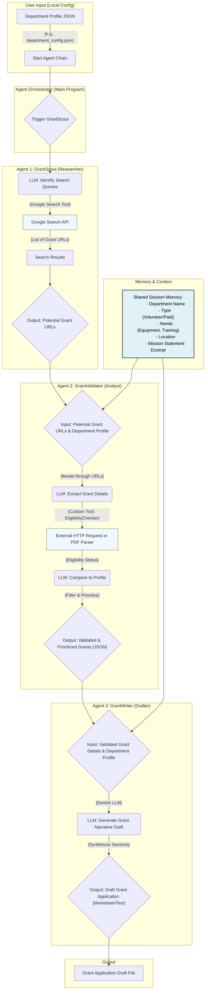

# Civic Grant Agent Core

An intelligent multi-agent system designed to automate the grant discovery, validation, and application process for civic organizations.

## 🚀 Quick Start

```bash
# Clone the repository
git clone https://github.com/xomanova/civic-grant-agent-core.git
cd civic-grant-agent-core

# Set up environment
python -m venv venv
source venv/bin/activate  # On Windows: venv\Scripts\activate

# Install dependencies (when available)
pip install -r requirements.txt

# Configure your department profile
cp config/department_profile.example.json config/my_department.json
# Edit my_department.json with your information

# Run the system
python main.py --config config/my_department.json
```

## 📚 Documentation

Comprehensive documentation is available in the `/docs` directory:

- **[Home](docs/Home.md)** - Overview and introduction
- **[Getting Started](docs/Getting-Started.md)** - Installation and setup guide
- **[Architecture](docs/Architecture.md)** - System design and components
- **[Agent Documentation](docs/Agents.md)** - Detailed agent specifications
- **[Configuration Guide](docs/Configuration.md)** - Configuration options
- **[Development Guide](docs/Development.md)** - Contributing and extending
- **[API Reference](docs/API-Reference.md)** - Technical API documentation
- **[FAQ](docs/FAQ.md)** - Frequently asked questions
- **[Troubleshooting](docs/Troubleshooting.md)** - Common issues and solutions
- **[Contributing](docs/Contributing.md)** - How to contribute

## 🎯 Features

- **Automated Grant Discovery**: Find relevant grant opportunities using AI-powered search
- **Intelligent Eligibility Validation**: Automatically check if your organization qualifies
- **Draft Generation**: Create comprehensive grant application drafts
- **Multi-Agent Architecture**: Specialized agents working together seamlessly

## 🏗️ System Architecture

The system uses three specialized AI agents that work together in a pipeline:

1. **GrantScout** - Discovers relevant grant opportunities
2. **GrantValidator** - Validates eligibility and prioritizes grants
3. **GrantWriter** - Generates application drafts

## Agent Flow Diagram


See the [Architecture Documentation](docs/Architecture.md) for detailed information about system design.

## 💡 Use Cases

- **Fire Departments**: Finding equipment and training grants
- **Volunteer Organizations**: Discovering funding opportunities  
- **Municipal Agencies**: Streamlining grant application processes
- **Emergency Services**: Automating grant research and writing

## 🔧 Requirements

- Python 3.9 or higher
- Google Search API key
- Gemini API key
- Internet connection

See the [Getting Started Guide](docs/Getting-Started.md) for detailed setup instructions.

## 📖 Learning Resources

### New to the Project?

1. Start with the [Home](docs/Home.md) page for an overview
2. Follow the [Getting Started Guide](docs/Getting-Started.md) to set up
3. Read the [FAQ](docs/FAQ.md) for common questions
4. Check the [Troubleshooting Guide](docs/Troubleshooting.md) if you encounter issues

### For Developers

1. Review the [Architecture](docs/Architecture.md) to understand the system
2. Read the [Development Guide](docs/Development.md) for contribution guidelines
3. Check the [API Reference](docs/API-Reference.md) for technical details
4. See [Contributing Guidelines](docs/Contributing.md) for best practices

## 🤝 Contributing

We welcome contributions! See our [Contributing Guidelines](docs/Contributing.md) for details on:

- Reporting bugs
- Suggesting features
- Submitting pull requests
- Development setup
- Coding standards

## 📝 License

[License information will be added]

## 🆘 Support

- **Documentation**: See the `/docs` directory
- **Issues**: [GitHub Issues](https://github.com/xomanova/civic-grant-agent-core/issues)
- **Discussions**: [GitHub Discussions](https://github.com/xomanova/civic-grant-agent-core/discussions)

## 🌟 Project Status

This project is in active development. Documentation and features will be updated as the system evolves.

## 📊 Related Resources

- [Google Code Wiki](https://developers.googleblog.com/en/introducing-code-wiki-accelerating-your-code-understanding/) - Reference for documentation best practices
- [FEMA Grant Programs](https://www.fema.gov/grants) - Federal grant resources
- [Assistance to Firefighters Grant (AFG)](https://www.fema.gov/grants/preparedness/firefighters) - Major grant program

## 🙏 Acknowledgments

Special thanks to all contributors and the open source community for making this project possible.