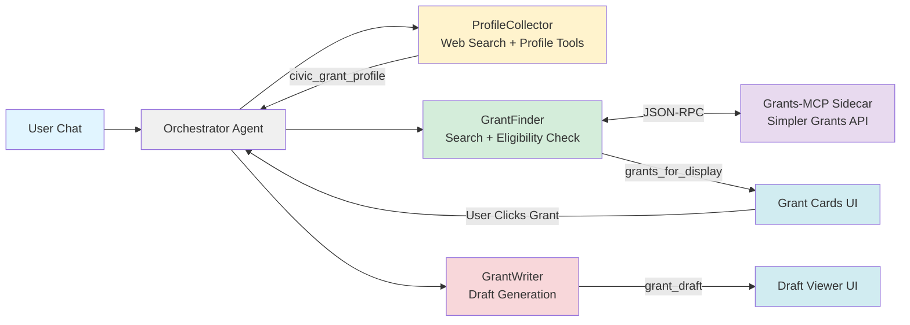

# Civic Grant Agent: AI-Powered Grant Finding for First Responders

**Subtitle:** A free, open-source multi-agent system that helps volunteer emergency responders discover, evaluate, and apply for life-saving funding.

**Submission Track:** Agents for Good of the [Kaggle/Google Agents Intensive: Capstone Project](https://www.kaggle.com/competitions/agents-intensive-capstone-project)

---

## The Problem: First Responders Left Behind

Volunteer Fire Departments, Rescue Squads, and EMS agencies are chronically underfunded. These organizations—staffed by neighbors who volunteer their nights and weekends to save lives—depend on complex federal, state, and corporate grants to purchase critical equipment like SCBA masks, turnout gear, and rescue tools.

But here's the cruel irony: **the same volunteers responding to 911 calls are the ones expected to find and write these grants.** They lack the time to research opportunities across dozens of portals and the specialized skills to craft compelling narratives that compete with professionally-staffed departments.

The result? **Millions of dollars in available funding go unclaimed every year** while first responders operate with aging equipment that puts both them and their communities at risk.

Commercial grant-writing platforms exist (Grantable, GrantWriter, etc.), but they cost $200-500/month—budgets that small volunteer departments simply don't have. These agencies need enterprise-grade automation at a price point of zero.

---

## The Solution: AI Agents as the Great Equalizer

**Civic Grant Agent** is built on a simple premise: **Technology should serve those who serve others.**

This project leverages the **Google Agent Development Kit (ADK)** to democratize grant access. It's not just an app—it's a **digital staff member** that joins the department. It autonomously:

1. **Interviews** the department to understand their unique situation (location, equipment needs, budget)
2. **Scouts** the web for matching grant opportunities (Grants.gov, FEMA AFG, Firehouse Subs Foundation, etc.)
3. **Filters** results using intelligent state-based eligibility checking
4. **Drafts** professional grant applications using the department's real data

**Value Proposition:** This agent transforms a 20-hour/week manual research task into a 1-hour review task, directly increasing a department's ability to secure funding for life-saving equipment.

---

## Architecture: State-Aware Multi-Agent Orchestration

### The Challenge: State Confusion in Agent Chains

During development, I encountered a critical issue with standard agent patterns: **State Confusion**. Agents would get "stuck" in the wrong workflow phase—the ProfileCollector wouldn't know when to stop asking questions, and the GrantFinder wouldn't know when to start searching. This created a disjointed user experience.

### The Solution: Custom Orchestrator Pattern

I built a dedicated **OrchestratorAgent** that acts as a state machine for the conversation. It monitors session state (checking flags like `profile_complete`), routes user input to the active sub-agent, and manages handoffs between agents when milestones are reached.

### The Agent Team

| Agent | Role | Tools | Output |
|-------|------|-------|--------|
| **OrchestratorAgent** | Routes requests based on workflow state | State management | Workflow transitions |
| **ProfileCollector** | Conducts conversational intake interview | Web Search, Profile Update | `civic_grant_profile` |
| **GrantFinder** | Discovers and validates grants | Web Search, Federal Grants API, Eligibility Checker, State Filter | `grants_for_display` |
| **GrantWriter** | Generates professional applications | Draft Storage | `grant_draft` |

### Grants-MCP Sidecar

The backend includes a **Grants-MCP sidecar container** that provides an MCP (Model Context Protocol) interface to the **Simpler Grants API** (simpler.grants.gov). This enables the GrantFinder agent to search federal grant opportunities directly from the official government database.

- **Architecture**: Runs as a Cloud Run sidecar container alongside the main backend
- **Protocol**: JSON-RPC via MCP for tool invocation
- **Data Source**: Simpler Grants API for real-time federal grant discovery
- **Tools Exposed**: `opportunity_discovery`, `agency_landscape`, `funding_trend_scanner`

### System Flow Diagram

---

## Technical Implementation: ADK Concepts Applied

This project demonstrates implementation of key ADK concepts:

### 1. Multi-Agent System (Custom Orchestrator)
Rather than a simple sequential pipeline, I implemented a **custom OrchestratorAgent** that extends `google.adk.agents.Agent` with a `_run_async_impl` method. This orchestrator:
- Monitors `workflow_step` state to determine which sub-agent should handle the request
- Detects profile completeness by checking actual data (not just flags)
- Manages transitions between `profile_building` → `grant_scouting` → `grant_writing`
- Suppresses internal agent chatter while streaming relevant content to the user

### 2. Custom Tools
Each agent has purpose-built tools registered via ADK's tool system:

- **`updateDepartmentProfile`**: Deep-merges incoming profile data with existing state
- **`exit_profile_loop`**: Signals profile completion and triggers workflow transition
- **`search_federal_grants`**: Queries the Grants-MCP sidecar for federal opportunities from Simpler Grants API
- **`save_grants_to_state`**: Stores validated grants with automatic state-based filtering
- **`save_grant_draft`**: Persists generated drafts and handles newline escaping for markdown rendering

### 3. Sessions & State Management
The entire system maintains state through ADK's session management:
- `civic_grant_profile`: Accumulated department information
- `grants_for_display`: Validated grants for UI rendering
- `grant_draft`: Generated application content
- `workflow_step`: Current position in the agent pipeline

**Stateless Backend by Design:** A critical architectural decision was keeping the backend completely stateless. The frontend (client-side) remains the authoritative source of truth, syncing state bidirectionally via **AG-UI Protocol** with CopilotKit's `useCoAgent` hook. 

This wasn't just a technical choice—it was a **cost and accessibility decision**:
- **Zero infrastructure costs** for persistent storage or databases
- **No user accounts required**—departments don't need yet another login to manage
- **Privacy-first**—sensitive department data stays in the user's browser, not on our servers
- **Simplicity**—volunteer fire chiefs can use the tool immediately without onboarding friction

For organizations already stretched thin on time and budget, eliminating account management and subscription overhead removes the last barrier to adoption.

### 4. Built-in Tools: Google Search
The **ProfileCollector** and **GrantFinder** agents leverage web search to:
- Enrich department profiles with publicly available data (county, population, founding date)
- Discover grant opportunities across FEMA, Firehouse Subs Foundation, Gary Sinise Foundation, and other sources

### 5. Effective Use of Gemini
All agents are powered by **Gemini 2.0 Flash** (`gemini-2.0-flash`), with the GrantWriter using elevated temperature (0.7) for more creative, compelling narratives. The ProfileCollector uses lower temperature for factual accuracy during data collection.

### 6. Agent Deployment (Bonus)
The system is fully containerized and deployed:
- **Backend**: FastAPI server with ADK agents, deployed to **Google Cloud Run**
- **Grants-MCP Sidecar**: MCP server for federal grant searches, runs alongside backend as a Cloud Run sidecar container
- **Frontend**: Next.js 14 React app with ag-ui and CopilotKit integration using **Firebase Hosting**
    - Firebase was put in place to support caching and more dynamic routing in the future
- **Deployment**: Single-command deployment via `./deployment/firebase-deploy.sh`
    - An all-in-one script that builds, pushes, and deploys both backend and frontend containers
    - A bash script is not ideal for a real production system, but was a huge time saver for this demo project
    - Over time the project should have a more robust CI/CD pipeline and IaC

---

## Key Development Insights

### Insight 1: State-Based Grant Filtering — When Geography Gets Complicated
Grant eligibility often depends on location, but determining "location" from unstructured grant data proved surprisingly complex.

**The Challenge:** The system needed nuanced filtering rules:
- **Include** federal grants (FEMA, USDA) regardless of department state
- **Include** national foundation grants (Firehouse Subs, Gary Sinise Foundation)
- **Exclude** state-specific grants from other states (e.g., Ohio Fire Marshal grants for an NC department)
- **Detect conflicts** where a grant name mentions one state but the URL indicates another

**The Complexity:** Grant sources don't follow consistent naming conventions. A grant titled "Rural Fire Department Equipment Program" might be federal, state-specific, or a national foundation—you can't tell from the name alone. URLs provide clues (`.gov` domains, state abbreviations), but require pattern matching across multiple formats.

**The Solution:** I implemented a multi-layered detection system with `is_federal_grant()`, `is_national_foundation_grant()`, and `get_grant_states()` functions. These analyze grant names, sources, and URL patterns (e.g., detecting `ohio.gov` in a URL to flag Ohio-specific grants). The system defaults to inclusion when uncertain, preferring false positives over missed opportunities.

This taught me that real-world data is messy, and agent tools need defensive logic to handle ambiguity gracefully.

### Insight 2: Agent Workflows — The Trouble of Prescribing Behavior in Conversational AI
Getting multiple agents to work together smoothly required careful prompt engineering and a lot of trial and error—especially since LLM behavior can be unpredictable.

**The Challenge:** When the GrantWriter called `save_grant_draft` with markdown content, the LLM sometimes passed literal `\n` characters instead of actual newlines, completely breaking markdown rendering in the frontend. Other times, agents would ignore tool instructions or call the wrong tools entirely.

**The Reality:** You can't fully "program" an LLM. Unlike traditional code where instructions execute deterministically, prompts are suggestions that the model interprets probabilistically. This means edge cases emerge that you never anticipated, and fixing one behavior can break another.

**The Solution:** A combination of increasingly explicit instructions in system prompts, separation of sub_agent concerns, and defensive post-processing (like `.replace('\\n', '\n')` before saving to shared CoAgent state to render to the user), and accepting that some agent behaviors need runtime guards rather than prompt-based prevention.

This insight shaped my approach: treat agent instructions as strong hints, but always validate and sanitize outputs before they reach the user.

### Insight 3: AG-UI Protocol — The Future of Agent Interfaces
I knew from the start that I wanted to build something immediately usable by public service agencies—not a CLI demo or notebook, but a real product. I discovered [CopilotKit](https://github.com/CopilotKit/CopilotKit) and the [AG-UI Protocol](https://github.com/ag-ui-protocol/ag-ui), which opened up exciting possibilities but also presented significant challenges.

**The Opportunity:** AG-UI enables bidirectional state synchronization between AI agents and React frontends. This means agents can directly update UI components—rendering grant cards, displaying drafts, and showing real-time profile data—without custom websocket plumbing. It's a glimpse of where agent UX is heading: AI-native interfaces where the model doesn't just respond to the UI, it *drives* it.

**The Challenge:** AG-UI is cutting-edge, which means rough edges. The ADK integration had bugs in event processing that caused state sync failures. I spent considerable time debugging issues that turned out to be library-level problems rather than my code.

**Giving Back:** Rather than just working around the issues, I contributed upstream. I submitted a PR fixing an event processing bug with Google ADK LLM responses—a bug implicated in multiple open issues on the ag-ui repo: [🐛 Bug Report](https://github.com/ag-ui-protocol/ag-ui/issues/735) | [🤝 Fix PR](https://github.com/ag-ui-protocol/ag-ui/pull/745#issuecomment-3588364960)

AG-UI represents an important evolution in how we build agent applications and the audiences with which the most advanced technologies can seamlessly integrate. The extra integration work was worth it to deliver a responsive, accessible interface that volunteer fire chiefs can actually use.

---

## A Personal Note

I am a software engineer by trade, but a volunteer firefighter and EMT by passion. I built *Civic Grant Agent* to bridge the gap between the technology I build during the day and the tools available to my station at night. This project is my contribution to the fire service: **open code for open hearts.**

---

## Links & Resources

- **GitHub Repository:** https://github.com/xomanova/civic-grant-agent-core
- **Live Demo:** https://civic-grant-agent.xomanova.io
