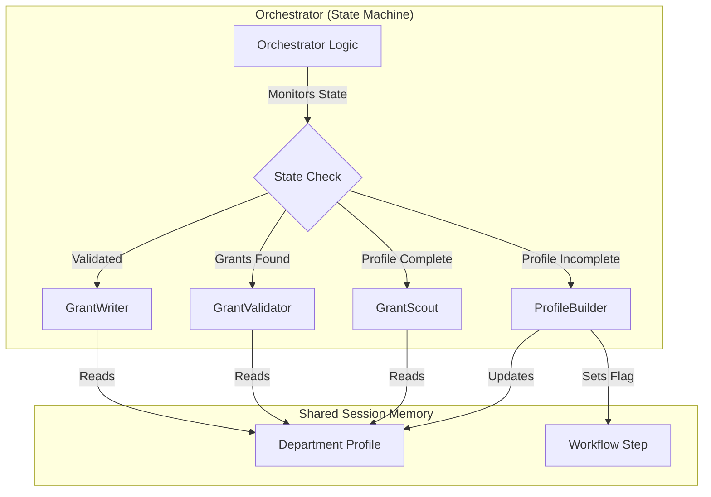

# Civic Grant Agent: The AI Grant Writer for First Responders

**Subtitle:** An open-source, multi-agent system that helps underfunded Volunteer Fire Departments find and secure life-saving funding.

**Submission Track:** Agents for Good

---

## Project Description

### The Problem: The Resource Gap

Volunteer Fire Departments (VFDs) and EMS agencies are chronically underfunded. We rely on complex federal, state, and corporate grants to buy life-saving equipment like turnout gear and SCBA masks. However, the people responsible for finding these grants are often the same people responding to 911 calls. They lack the time to scroll through endless listings and the specialized grant-writing skills to craft compelling narratives.

Historically, accessing enterprise-grade workflow automation required two things these agencies lack: massive budgets and dedicated IT staff. As a result, millions of dollars in grant funding go unclaimed every year while first responders go without essential gear.

### The Solution: AI Agents as the Great Equalizer
**Civic Grant Agent** is built on a simple premise: **Technology should serve those who serve others.**

This project leverages the **Google Agent Development Kit (ADK)** to tear down the paywall between first responders and high-end automation. It isn't just an app; it is a **digital staff member** that joins the department. It autonomously scouts for opportunities, reads the fine print to validate eligibility, and drafts professional grant narratives using the specific context of the department's needs.

### How It Works: The Agent Architecture
To solve this complex problem, I moved beyond a simple sequential pipeline and implemented a **State-Aware Multi-Agent System** managed by a **Custom Orchestrator**.

**The Challenge: State Confusion**
During development, I encountered a critical issue with standard agent chains: **State Confusion**. Agents would often get "stuck" in the wrong persona or fail to recognize when a task was complete. The `ProfileBuilder` wouldn't know when to stop asking questions, and the `GrantScout` wouldn't know when to start searching, leading to a disjointed user experience.

**The Solution: The Orchestrator Pattern**
To fix this, I built a dedicated `OrchestratorAgent` that acts as a state machine for the conversation. It monitors the session state (e.g., checking if `profile_complete` is true). When a milestone is reached, it forcibly transitions the workflow and injects "System Alerts" (hidden prompts) to wake up the next agent with the correct context.

The team consists of:

1.  **`OrchestratorAgent` (The Manager):** The brain of the operation. It routes user input to the active sub-agent based on the current `workflow_step` and handles the handoffs between agents.
2.  **`ProfileBuilder` Agent (The Interviewer):** Conducts a natural language interview. It uses **Session Memory** to build a comprehensive `Department Profile` (location, volunteer status, equipment needs).
3.  **`GrantScout` Agent (The Researcher):** Triggered by the Orchestrator once the profile is locked. It utilizes the **Google Search Tool** to scan the web for live grant opportunities.
4.  **`GrantValidator` Agent (The Analyst):** The quality control layer. It reads raw grant pages and cross-references them against the `Department Profile` using a **Custom Tool** to check for hard eligibility requirements.
5.  **`GrantWriter` Agent (The Author):** Powered by **Gemini**, this agent writes the persuasive narrative, injecting the department's specific mission into the grant's requirements.

#### System Architecture

### Technical Implementation & ADK Concepts
This project demonstrates a production-ready implementation of the ADK, hitting several key course concepts:

* **Multi-Agent System:** I used a sequential orchestration pattern where the output of one agent (e.g., a list of URLs) becomes the context for the next.
* **Tools (Built-in & Custom):** The system leverages the built-in Google Search tool for discovery and custom Python functions for logic-based validation.
* **Sessions & Memory:** The `Department Profile` is maintained as a session object. This allows the agents to maintain "focus" across the entire workflow without hallucinating details about the department.
* **Agent Deployment (Bonus):** The entire core is containerized using **Docker** and deployed to **Google Cloud Run**. The frontend uses **AG-UI** and **CopilotKit**, connected to the backend via a FastAPI middleware, creating a seamless, real-time streaming experience for the user.

### The "Aha!" Moment: Meta-Prompting
One of the most interesting challenges during development was tuning the `GrantValidator`. Initially, it was too aggressive, rejecting valid grants because of ambiguous language.

I realized I was guessing at how to fix the system prompt. So, I turned to the agent itself. I implemented a feedback loop where I asked the agent: *"You just rejected a valid grant. Look at your own system instructions and tell me which specific line caused you to be too aggressive, and how I should rewrite it."*

The agent immediately analyzed its own logic, pointed to a specific constraint about "explicit eligibility," and rewrote the instruction for me. This technique—**Reflexive Prompting**—became a core part of my development workflow, allowing the AI to help architect its own brain.

### A Note from the Developer
I am a software engineer by trade, but I am a Volunteer Firefighter and EMT by passion. I see firsthand the gap between the technology I build during the day and the tools available to my station at night.

I built the *Civic Grant Agent* to bridge that gap. My mission is to bring my technical skillset to bear for my brothers and sisters in the fire service, ensuring they never have to choose between buying life-saving equipment and paying for the software needed to fund it.

This project is my contribution to the open-source community: open code for open hearts.

---

### Links & Resources
* **GitHub Repository:** [Insert Link Here]
* **Live Demo:** [Insert Link Here]
* **Video Demo:** [Insert YouTube Link Here]
