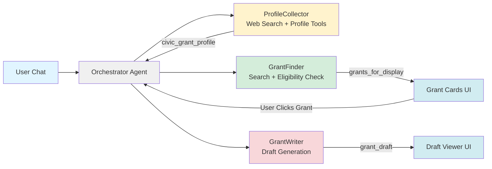

# Civic Grant Agent: AI-Powered Grant Finding for First Responders

**Subtitle:** A free, open-source multi-agent system that helps underfunded volunteer fire departments discover, evaluate, and apply for life-saving funding.

**Submission Track:** Agents for Good

---

## The Problem: First Responders Left Behind

Volunteer Fire Departments (VFDs) and EMS agencies are chronically underfunded. These organizations—staffed by neighbors who volunteer their nights and weekends to save lives—depend on complex federal, state, and corporate grants to purchase critical equipment like SCBA masks, turnout gear, and rescue tools.

But here's the cruel irony: **the same volunteers responding to 911 calls are the ones expected to find and write these grants.** They lack the time to research opportunities across dozens of portals and the specialized skills to craft compelling narratives that compete with professionally-staffed departments.

The result? **Millions of dollars in available funding go unclaimed every year** while first responders operate with aging equipment that puts both them and their communities at risk.

Commercial grant-writing platforms exist (Grantable, GrantWriter, etc.), but they cost $200-500/month—budgets that small volunteer departments simply don't have. These agencies need enterprise-grade automation at a price point of zero.

---

## The Solution: AI Agents as the Great Equalizer

**Civic Grant Agent** is built on a simple premise: **Technology should serve those who serve others.**

This project leverages the **Google Agent Development Kit (ADK)** to democratize grant access. It's not just an app—it's a **digital staff member** that joins the department. It autonomously:

1. **Interviews** the department to understand their unique situation (location, equipment needs, budget)
2. **Scouts** the web for matching grant opportunities (FEMA AFG, Firehouse Subs Foundation, etc.)
3. **Filters** results using intelligent state-based eligibility checking
4. **Drafts** professional grant applications using the department's real data

**Value Proposition:** This agent transforms a 20-hour/week manual research task into a 1-hour review task, directly increasing a department's ability to secure funding for life-saving equipment.

---

## Architecture: State-Aware Multi-Agent Orchestration

### The Challenge: State Confusion in Agent Chains

During development, I encountered a critical issue with standard agent patterns: **State Confusion**. Agents would get "stuck" in the wrong workflow phase—the ProfileCollector wouldn't know when to stop asking questions, and the GrantFinder wouldn't know when to start searching. This created a disjointed user experience.

### The Solution: Custom Orchestrator Pattern

I built a dedicated **OrchestratorAgent** that acts as a state machine for the conversation. It monitors session state (checking flags like `profile_complete`), routes user input to the active sub-agent, and manages handoffs between agents when milestones are reached.

### The Agent Team

| Agent | Role | Tools | Output |
|-------|------|-------|--------|
| **OrchestratorAgent** | Routes requests based on workflow state | State management | Workflow transitions |
| **ProfileCollector** | Conducts conversational intake interview | Web Search, Profile Update | `civic_grant_profile` |
| **GrantFinder** | Discovers and validates grants | Web Search, Eligibility Checker, State Filter | `grants_for_display` |
| **GrantWriter** | Generates professional applications | Draft Storage | `grant_draft` |

### System Flow Diagram

---

## Technical Implementation: ADK Concepts Applied

This project demonstrates production-ready implementation of key ADK concepts:

### 1. Multi-Agent System (Custom Orchestrator)
Rather than a simple sequential pipeline, I implemented a **custom OrchestratorAgent** that extends `google.adk.agents.Agent` with a `_run_async_impl` method. This orchestrator:
- Monitors `workflow_step` state to determine which sub-agent should handle the request
- Detects profile completeness by checking actual data (not just flags)
- Manages transitions between `profile_building` → `grant_scouting` → `grant_writing`
- Suppresses internal agent chatter while streaming relevant content to the user

### 2. Custom Tools
Each agent has purpose-built tools registered via ADK's tool system:

- **`updateDepartmentProfile`**: Deep-merges incoming profile data with existing state
- **`exit_profile_loop`**: Signals profile completion and triggers workflow transition
- **`save_grants_to_state`**: Stores validated grants with automatic state-based filtering
- **`save_grant_draft`**: Persists generated drafts and handles newline escaping for markdown rendering

### 3. Sessions & State Management
The entire system maintains state through ADK's session management:
- `civic_grant_profile`: Accumulated department information
- `grants_for_display`: Validated grants for UI rendering
- `grant_draft`: Generated application content
- `workflow_step`: Current position in the agent pipeline

**Stateless Backend by Design:** A critical architectural decision was keeping the backend completely stateless. The frontend (client-side) remains the authoritative source of truth, syncing state bidirectionally via **AG-UI Protocol** with CopilotKit's `useCoAgent` hook. 

This wasn't just a technical choice—it was a **cost and accessibility decision**:
- **Zero infrastructure costs** for persistent storage or databases
- **No user accounts required**—departments don't need yet another login to manage
- **Privacy-first**—sensitive department data stays in the user's browser, not on our servers
- **Simplicity**—volunteer fire chiefs can use the tool immediately without onboarding friction

For organizations already stretched thin on time and budget, eliminating account management and subscription overhead removes the last barrier to adoption.

### 4. Built-in Tools: Google Search
The **ProfileCollector** and **GrantFinder** agents leverage web search to:
- Enrich department profiles with publicly available data (county, population, founding date)
- Discover grant opportunities across FEMA, Firehouse Subs Foundation, Gary Sinise Foundation, and other sources

### 5. Effective Use of Gemini
All agents are powered by **Gemini 2.0 Flash** (`gemini-2.0-flash`), with the GrantWriter using elevated temperature (0.7) for more creative, compelling narratives. The ProfileCollector uses lower temperature for factual accuracy during data collection.

### 6. Agent Deployment (Bonus)
The system is fully containerized and deployed:
- **Backend**: FastAPI server with ADK agents, deployed to **Google Cloud Run**
- **Frontend**: Next.js 14 React app with CopilotKit integration
- **Deployment**: Single-command deployment via `./deployment/firebase-deploy.sh`

---

## Key Development Insights

### Insight 1: State-Based Grant Filtering
A significant challenge was filtering grants appropriately. The system needed to:
- **Include** federal grants (FEMA, USDA) regardless of state
- **Include** national foundation grants (Firehouse Subs, Gary Sinise)
- **Exclude** state-specific grants from other states (Ohio Fire Marshal for an NC department)
- **Detect conflicts** where a grant name mentions one state but the URL indicates another

I implemented `is_federal_grant()`, `is_national_foundation_grant()`, and `get_grant_states()` functions that analyze grant names, sources, and even URL patterns (e.g., detecting `ohio.gov` in a URL to flag Ohio-specific grants).

### Insight 2: Tool-Based State Sync
Initially, I tried saving grant drafts to state after the agent loop completed—but the state never synced to the frontend. The fix: **state updates must happen via tool calls** during the agent loop, not after. This ensures AG-UI Protocol properly transmits the state change.

### Insight 3: Escaped Newlines in LLM Output
When the GrantWriter called `save_grant_draft` with markdown content, the LLM sometimes passed literal `\n` characters instead of actual newlines, breaking markdown rendering. The solution: post-process content with `.replace('\\n', '\n')` before saving to state.

---

## A Personal Note

I am a software engineer by trade, but a volunteer firefighter and EMT by passion. I built *Civic Grant Agent* to bridge the gap between the technology I build during the day and the tools available to my station at night. This project is my contribution to the fire service: **open code for open hearts.**

---

## Links & Resources

- **GitHub Repository:** https://github.com/xomanova/civic-grant-agent-core
- **Live Demo:** https://civic-grant-agent.xomanova.io
- **Video Demo:** [YouTube Link]
