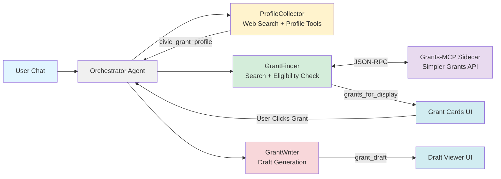

# SUBMISSION.md - but less than 1500 words!

**A free, open-source multi-agent system that helps volunteer emergency responders discover, evaluate, and apply for life-saving funding.**

**Submission Track:** Agents for Good — [Kaggle/Google Agents Intensive Capstone](https://www.kaggle.com/competitions/agents-intensive-capstone-project)

---

## The Problem

Volunteer Fire Departments, Rescue Squads, and EMS agencies are chronically underfunded. These organizations—staffed by neighbors who volunteer their nights and weekends—depend on complex grants to purchase critical equipment like SCBA masks, turnout gear, and rescue tools.

The cruel irony: **the same volunteers responding to 911 calls are expected to find and write these grants.** They lack time to research opportunities across dozens of portals and the skills to craft compelling narratives that compete with professionally-staffed departments.

**Millions of dollars go unclaimed every year** while first responders operate with aging equipment. Commercial grant-writing platforms cost $200-500/month—budgets small volunteer departments don't have.

---

## The Solution

**Civic Grant Agent** leverages the **Google Agent Development Kit (ADK)** to democratize grant access. It autonomously:

1. **Interviews** the department to understand their situation (location, equipment needs, budget)
2. **Scouts** the web for matching opportunities (Grants.gov, FEMA AFG, Firehouse Subs Foundation)
3. **Filters** results using intelligent state-based eligibility checking
4. **Drafts** professional grant applications using the department's real data

**Value:** This transforms a 20-hour/week manual task into a 1-hour review task.

---

## Why Agents?

Grant discovery and writing isn't a single task—it's a **workflow** requiring different skills at each stage: interviewing, researching, filtering, and writing. Traditional apps force users through rigid forms; LLMs alone lack memory and tool access.

**Agents are the right solution because:**
- **Workflow orchestration**: Multiple specialized agents handle distinct phases, handing off context seamlessly
- **Tool integration**: Agents can search the web, query APIs, and save state—combining LLM intelligence with real-world data
- **Conversational UX**: Users describe their needs naturally; agents extract structure from unstructured input
- **Autonomy**: Once given a profile, the system works independently—exactly what time-strapped volunteers need

---

## Architecture: Multi-Agent Orchestration

### The Challenge

Standard agent patterns caused **State Confusion**—agents got "stuck" in wrong workflow phases. The ProfileCollector wouldn't know when to stop asking questions; the GrantFinder wouldn't know when to start.

### The Solution

I built a **custom OrchestratorAgent** that acts as a state machine. It monitors session state, routes input to the active sub-agent, and manages handoffs when milestones are reached.

### The Agent Team

| Agent | Role | Tools | Output |
|-------|------|-------|--------|
| **OrchestratorAgent** | Routes based on workflow state | State management | Workflow transitions |
| **ProfileCollector** | Conversational intake interview | Web Search, Profile Update | `civic_grant_profile` |
| **GrantFinder** | Discovers and validates grants | Web Search, Federal Grants API, Eligibility Checker | `grants_for_display` |
| **GrantWriter** | Generates applications | Draft Storage | `grant_draft` |

### Grants-MCP Sidecar

A **Grants-MCP sidecar container** provides an MCP interface to the **Simpler Grants API** (simpler.grants.gov), enabling direct federal grant searches from the official government database.

### System Flow Diagram

---

## Technical Implementation

### 1. Custom Orchestrator
The **OrchestratorAgent** extends `google.adk.agents.Agent`:
- Monitors `workflow_step` state to route requests
- Detects profile completeness by checking actual data
- Manages transitions: `profile_building` → `grant_scouting` → `grant_writing`

### 2. Custom Tools
- **`updateDepartmentProfile`**: Deep-merges profile data with existing state
- **`search_federal_grants`**: Queries Grants-MCP sidecar for federal opportunities
- **`save_grants_to_state`**: Stores validated grants with state-based filtering
- **`save_grant_draft`**: Persists drafts with markdown handling

### 3. Stateless Backend
The frontend remains the authoritative source of truth, syncing bidirectionally via **AG-UI Protocol** with CopilotKit's `useCoAgent` hook. This was a **cost and accessibility decision**:
- Zero infrastructure costs for storage
- No user accounts required
- Privacy-first—data stays client-side
- Immediate use without onboarding

### 4. Built-in Tools
Agents leverage **Google Search** to enrich profiles and discover grants across FEMA, Firehouse Subs Foundation, and other sources.

### 5. Gemini Integration
All agents use **Gemini 2.0 Flash**. GrantWriter uses elevated temperature (0.7) for creative narratives; ProfileCollector uses lower temperature for factual accuracy.

### 6. Deployment
- **Backend**: FastAPI + ADK on **Google Cloud Run**
- **Grants-MCP Sidecar**: Runs alongside backend as Cloud Run sidecar
- **Frontend**: Next.js 14 + CopilotKit on **Firebase Hosting**
- **Deploy**: Single command via `./deployment/firebase-deploy.sh`

---

## Key Development Insights

### Insight 1: State-Based Grant Filtering

**The Challenge:** Nuanced filtering rules were needed:
- Include federal grants regardless of state
- Include national foundations (Firehouse Subs, Gary Sinise)
- Exclude state-specific grants from other states
- Detect conflicts where grant names and URLs indicate different states

**The Complexity:** Grant sources don't follow consistent naming. A "Rural Fire Department Equipment Program" might be federal, state-specific, or foundation-based.

**The Solution:** Multi-layered detection with `is_federal_grant()`, `is_national_foundation_grant()`, and `get_grant_states()` analyzing names, sources, and URL patterns.

### Insight 2: Prescribing Agent Behavior

**The Challenge:** The GrantWriter sometimes passed literal `\n` characters instead of newlines, breaking markdown rendering. Agents would ignore instructions or call wrong tools.

**The Reality:** You can't fully "program" an LLM. Prompts are suggestions interpreted probabilistically.

**The Solution:** Explicit prompt instructions, separation of sub-agent concerns, and defensive post-processing. Treat agent instructions as hints; always validate outputs.

### Insight 3: AG-UI Protocol

**The Opportunity:** [AG-UI](https://github.com/ag-ui-protocol/ag-ui) enables bidirectional state sync between agents and React frontends. Agents directly update UI components without custom websocket plumbing—AI-native interfaces where the model *drives* the UI.

**The Challenge:** AG-UI is cutting-edge with rough edges. The ADK integration had event processing bugs causing state sync failures.

**Giving Back:** I contributed upstream, submitting a PR fixing an event processing bug with ADK LLM responses: [🐛 Bug](https://github.com/ag-ui-protocol/ag-ui/issues/735) | [🤝 Fix](https://github.com/ag-ui-protocol/ag-ui/pull/745)

The extra work was worth it to deliver an accessible interface volunteer fire chiefs can actually use.

---

## Demo

**Try it live:** [civic-grant-agent.xomanova.io](https://civic-grant-agent.xomanova.io)

The demo walks through the full workflow:
1. Chat with the agent to build your department profile, or use one of the examples here: [Example Agency Descriptions](https://github.com/xomanova/civic-grant-agent-core/tree/main/assets/example_prompts) 
2. Watch as grants are discovered and displayed as interactive cards
3. Click any grant to generate a professional draft application

---

## If I Had More Time

- **Robust CI/CD**: Replace the bash deployment script with proper testing, IaC, and pipelines
- **Persistent profiles**: Allow the option for departments to save and reload their profiles across sessions
- **Grant calendar**: Track deadlines and send reminders
- **Application tracking**: Monitor submitted applications and outcomes
- **Expanded data sources**: Integrate more state-specific grant databases and foundation APIs
- **Collaborative editing**: Let multiple department members review and edit drafts together

---

## A Personal Note

I am a software engineer by trade, but a volunteer firefighter and EMT by passion. I built *Civic Grant Agent* to bridge the gap between the technology I build during the day and the tools available to my station at night. This is my contribution to the fire service: **open code for open hearts.**

---

## Links

- **GitHub:** https://github.com/xomanova/civic-grant-agent-core
- **Live Demo:** https://civic-grant-agent.xomanova.io
