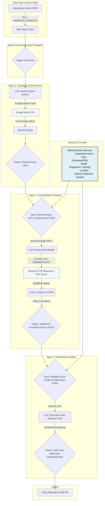

# Architecture Overview

This document provides a comprehensive overview of the Civic Grant Agent Core architecture.

## System Design Philosophy

The Civic Grant Agent Core follows a **multi-agent architecture** where specialized AI agents collaborate to complete the grant application process. Each agent has:

- A specific role and responsibility
- Access to specialized tools and APIs
- Shared context through session memory
- The ability to pass information to subsequent agents

## Agent Flow Diagram

## Core Components

### 1. Department Profile (Input)

The system begins with a department profile configuration file (JSON format) containing:

- **Department Name**: Official name of the organization
- **Department Type**: Volunteer, paid, or hybrid
- **Location**: Geographic information for location-specific grants
- **Needs**: Equipment, training, facilities, etc.
- **Mission Statement**: Brief excerpt describing the department's mission
- **Budget Information**: Financial context for grant amounts

### 2. Agent Orchestrator

The main program that:

- Loads the department profile
- Initializes shared session memory
- Triggers agents in sequence
- Manages data flow between agents
- Handles error recovery and logging

### 3. Shared Session Memory

A persistent context store that maintains:

- Department profile information
- Intermediate results from each agent
- Validation history
- Application drafts and revisions

This allows agents to access common context without redundant data passing.

## Agent Details

### Agent 1: GrantScout (Researcher)

**Purpose**: Discover relevant grant opportunities

**Inputs**:
- Department profile from shared memory
- Search parameters and filters

**Process**:
1. Analyze department profile to identify key needs
2. Generate targeted search queries
3. Execute searches using Google Search API
4. Extract and collect grant opportunity URLs
5. Perform initial relevance filtering

**Outputs**:
- List of potential grant URLs
- Initial relevance scores
- Search metadata

**Tools Used**:
- Google Search API
- Web scraping utilities
- URL validation tools

### Agent 2: GrantValidator (Analyst)

**Purpose**: Validate grant eligibility and prioritize opportunities

**Inputs**:
- List of grant URLs from GrantScout
- Department profile from shared memory

**Process**:
1. Iterate through each grant URL
2. Extract grant details (eligibility, deadlines, amounts)
3. Parse PDF documents when necessary
4. Compare requirements against department profile
5. Calculate eligibility scores
6. Prioritize based on fit and potential

**Outputs**:
- Validated and prioritized grant list (JSON)
- Eligibility analysis for each grant
- Recommended applications

**Tools Used**:
- EligibilityChecker (custom tool)
- HTTP request utilities
- PDF parser
- Text extraction tools

### Agent 3: GrantWriter (Drafter)

**Purpose**: Generate grant application drafts

**Inputs**:
- Validated grant details from GrantValidator
- Department profile from shared memory
- Grant-specific requirements and questions

**Process**:
1. Analyze grant application requirements
2. Extract key questions and sections
3. Generate narrative content using Gemini LLM
4. Synthesize department information with grant requirements
5. Format output according to grant specifications
6. Create cohesive draft document

**Outputs**:
- Draft grant application (Markdown/Text format)
- Section-by-section content
- Suggested attachments list

**Tools Used**:
- Gemini LLM (Google's language model)
- Template engines
- Document formatting tools

## Data Flow

1. **Input Stage**: User provides department profile JSON
2. **Discovery Stage**: GrantScout finds opportunities → URLs list
3. **Validation Stage**: GrantValidator analyzes → Validated grants JSON
4. **Drafting Stage**: GrantWriter creates → Application draft file
5. **Output Stage**: User reviews and refines draft

## Technology Stack

- **Language Models**: Gemini (Google), potentially OpenAI GPT
- **APIs**: Google Search API
- **Document Processing**: PDF parsing libraries
- **Data Format**: JSON for structured data, Markdown for drafts
- **Programming Language**: (To be determined based on implementation)

## Security Considerations

- API keys stored securely in environment variables
- Department profile data kept local
- No sensitive information in logs
- Compliance with grant application privacy requirements

## Scalability

The architecture supports:

- Parallel grant processing
- Multiple department profiles
- Batch operations
- Cloud deployment options

## Future Enhancements

- **Agent 4: GrantTracker** - Monitor application status and deadlines
- **Agent 5: GrantReviewer** - Quality assurance and improvement suggestions
- **Web Interface** - User-friendly dashboard for non-technical users
- **Database Integration** - Persistent storage for historical grants
- **Notification System** - Alerts for deadlines and new opportunities
